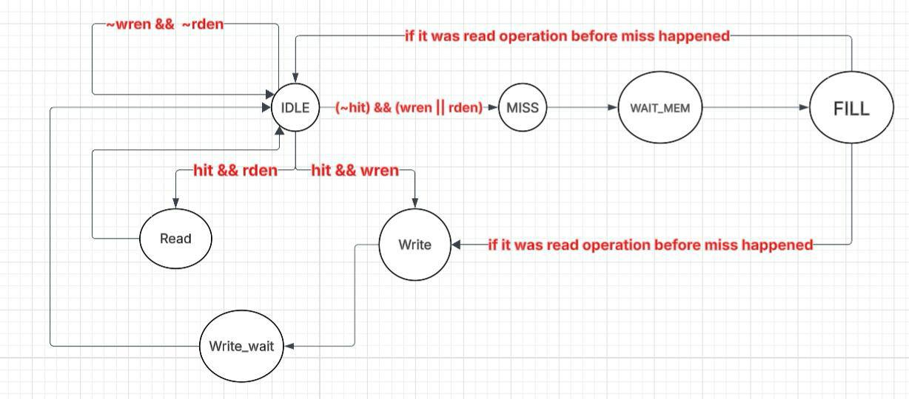
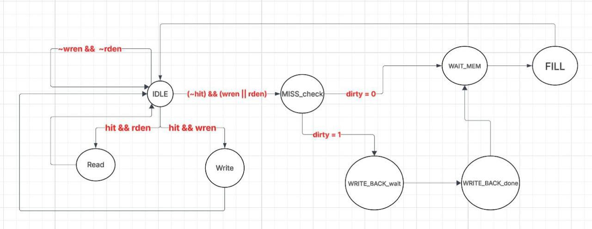

# Verilog Cache Controller Implementations

A comprehensive hardware design repository featuring synthesizable Verilog models for CPU cache memory systems. This project includes both Direct-Mapped and N-Way Set-Associative cache controllers, a simulated synchronous main memory module, and exhaustive testbenches designed to verify hit/miss logic, cache replacement policies, and memory-write operations.

## Key Features

* Direct-Mapped Cache (Cache.v): Implements a standard direct-mapped architecture configured with a write-through policy to memory.
* N-Way Set-Associative Cache (Cache_Bonus.v): A parameterized N-way design (default 4-way, 64 sets) featuring a Write-Back policy utilizing dirty bits and a Least Recently Used (LRU) replacement algorithm. 
* Robust FSM Architecture: Both controllers are driven by a Finite State Machine (FSM) handling precise clock-cycle and memory synchronization across states.
* Clean Initialization: Ensures deterministic behavior by correctly initializing all valid bits and tags strictly to zero on startup, preventing undefined states during early simulation.
* Synchronous RAM (memory.v): A customizable main memory module (default depth of 65,536) acting as the backing store for cache misses and write-backs.

## Finite State Machine (FSM) Diagrams

The control logic for both cache designs is governed by state machines that handle CPU requests, cache hits/misses, and memory synchronization.

### 1. Direct-Mapped Cache FSM
This state machine drives the Cache.v module. It handles standard hit/miss logic and incorporates a write-through policy (Write_wait), alongside memory fetch states (MISS, WAIT_MEM, FILL).

### 2. N-Way Set-Associative Cache FSM
This state machine drives the Cache_Bonus.v module. In addition to standard read/write handling, it manages the write-back replacement policy. You can observe the specific states dedicated to checking for dirty bits and writing evicted blocks back to main memory (MISS_CHECK, WRITE_BACK_wait, WRITE_BACK_done).

## Simulation 

The provided testbenches utilize standard simulated CPU access routines (cpu_access tasks) to validate hardware behavior under various scenarios:

* Write Misses: Verifies "Write Allocate" operations by fetching a block from memory before writing the new data into the cache.
* Hit Logic: Validates successful Read and Write Hits, including updating cache lines and appropriately marking lines as dirty (in the write-back design).
* Conflict Misses (Thrashing): Simulates scenarios where different memory addresses with distinct tags map to the exact same index, verifying proper replacement behavior.
* Eviction & Write-Back Verification: Forces eviction by systematically filling ways within the same set to trigger the LRU replacement algorithm. Specifically validates that modified (dirty) lines are accurately written back to main memory before eviction.

## Configuration

Both cache modules are heavily parameterized for easy scaling. You can modify parameters such as MEM_WIDTH, MEM_DEPTH, NWAYS, and NSETS directly when instantiating the modules in your own top-level designs.
